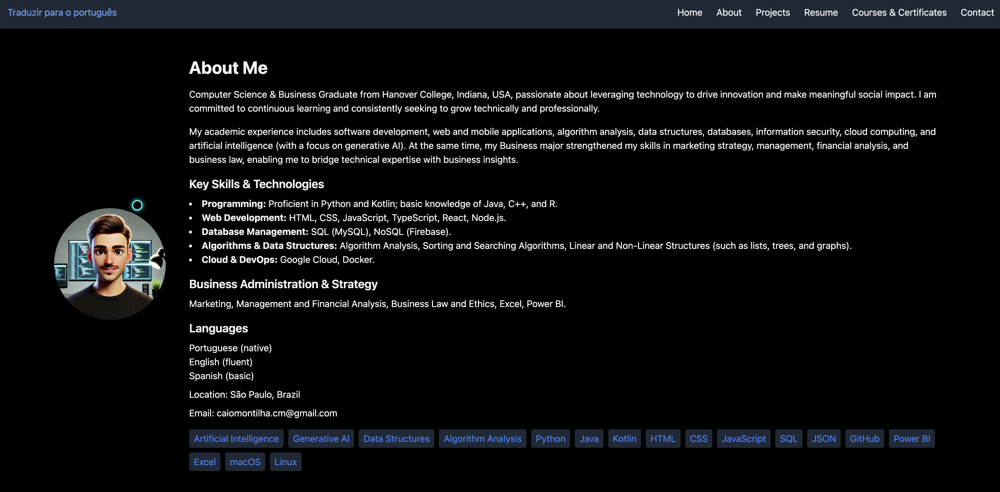
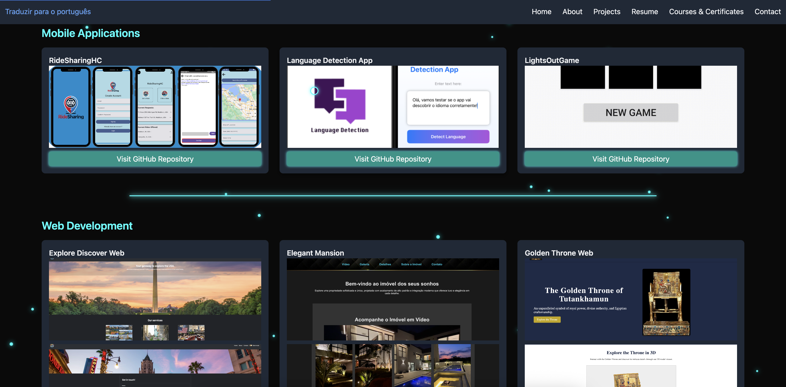
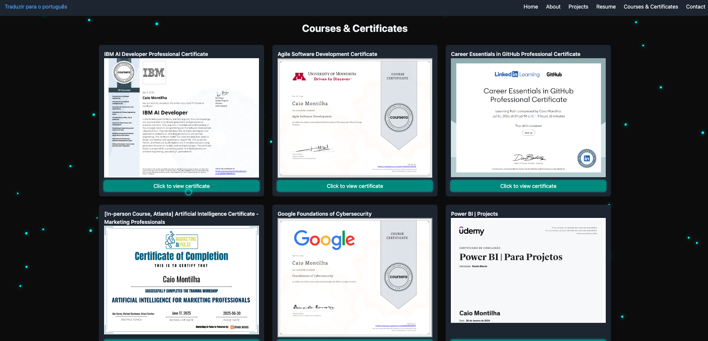

# **Caio Montilha's Portfolio**

Welcome to my personal portfolio, where you can explore my journey. This portfolio showcases my **technical skills**, **projects**, and **professional experiences**, reflecting my passion for **innovation** and **problem-solving** in the tech and business sectors.

---

## 🚀 **Preview**

Here’s a quick look at the main page of my portfolio:

### 👉 **[Click here to access my portfolio](https://cmontilha.github.io/CaioPortfolio/)**

---

---

## **Overview**

**Senior Computer Science & Business student at Hanover College, Indiana, USA**, passionate about leveraging technology to drive innovation and efficiency.

My academic expertise spans software development, web and mobile applications, algorithm analysis, data structures, databases, information security, cloud computing, and artificial intelligence (with a focus on generative AI).

## 🛠 **Key Skills & Technologies**
- **Programming:** Proficient in Python and Kotlin; familiar with Java, C++, and R.
- **Web Development:** HTML, CSS, JavaScript, TypeScript, React, Node.js.
- **Database Management:** SQL (MySQL, Supabase), NoSQL (MongoDB, Firebase).
- **Algorithms & Data Structures:** Algorithm Analysis, Sorting and Searching Algorithms, Linear and Non-Linear Structures (such as lists, trees, and graphs).
- **Cloud & DevOps:** AWS, Google Cloud, Docker, Kubernetes.

## 🌟 **Business Administration & Strategy**
- Marketing, Management and Financial Analysis, Business Law and Ethics, Excel, Power BI.

## 💬 **Languages**
- **Portuguese** (native)
- **English** (fluent)
- **Spanish** (basic)

---

## 🎯 **Key Highlights**

- **🚀 Project Showcase**: A collection of apps and projects that demonstrate my ability to solve complex problems using modern technologies.
- **🛠 Skills**: A list of programming languages, tools, and technologies I am proficient in, including **Python**, **Java**, **Kotlin**, **C++**, and **JavaScript**, among others.
- **📧 Contact Information**: Easy access to my professional profiles and contact methods, including **LinkedIn** and **email**.

---

## 💬 **Let's Connect**

Thank you for your interest in my portfolio. Feel free to reach out! I am open to discussing potential **collaborations** or **opportunities**.

---

## 📄 License

Created by Caio Montilha. This project is licensed under the MIT License.  